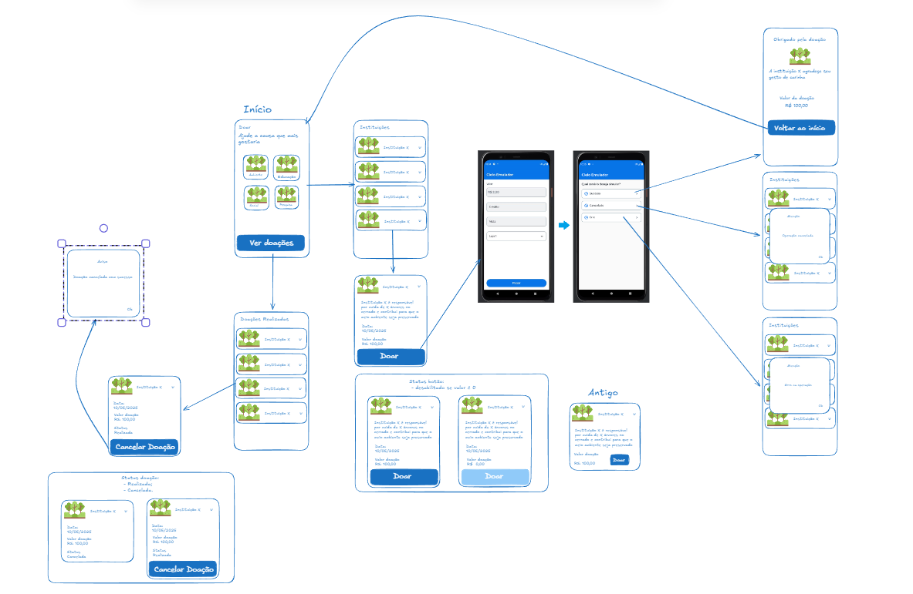

# Projeto Faça uma doação

## Introdução
Projeto que permite ao usuário realizar uma doação para uma instituição de sua
preferência com o uso do meio de pagamento da Cielo

Ele disponibiliza ao usuário categorias de ONGs, listando-as ao selecionar uma em específico, sendo elas:

* Ambiental;
* Pesquisa;
* Social;
* Educaação.

O usuário pode confirmar a sua doação e pagar com o meio de pagamento Cielo. Também é possível ver as doações feitas e cancelar a qualque
momento.

## Fluxo
O projeto tem o fluxo feito no [Excalidraw](https://excalidraw.com/) (cielo.excalidraw).

## Desenvolvimento
Cada tela é uma feature segregada do app. com clean architeture em seu desenvolvimento.
Todas são instanciadas em uma activity única (container) e a navegação é via nav graph. Desta forma,quem controla toda a parte de voltar é
esta activity única.

**BaseFragment**: que todos os fragment usam, permitindo fazer a chamada a simulador via Intent passando a uri correspondente em um ponto central.
**MainActivity**: recebe o Intent correspondente e envia ao dispatcher.
**PaymentDispatcher**: recebe a ação a ser executada e emite ela em um fluxo escutados pelas features interessadas.
**Features**: feitas com MVVM, esutam o dispatcher e tomam as ações necessárias para fazer o fluxo.
**Commom**: possui utils do projeto.

As funcionalidades de backend de gravar as doações, listar ONGs e categorias foram feitas no paccote de framework (que grava e busca as
doações) e também em arquivos JSON lidos nos endpoints simulados de cada feature.  

## Pagamentos
A comunicação com as funcionallidades de pagar, cancelar e listr pagamentos (doações) com o apk da Cielo são feitss via deeplink. O apk permite
simular sucesso, erro ou cancelamento de uma operação.

## Executando o projeto
Use o seu **Client ID** e **Access Token** da sua conta na págoina de [desenvolvedores da Cielo](https://desenvolvedores.cielo.com.br/api-portal/).
Insira no esu arquivo local.properties que o projeto irá ler dele e gerar o BuildConfig correspondente.
Esse é uma boa medida de seguração porque os local.properties nunca é commitado.
Exemplo:
CLIENT_ID=xyz123
ACCESS_TOKEN=abc456